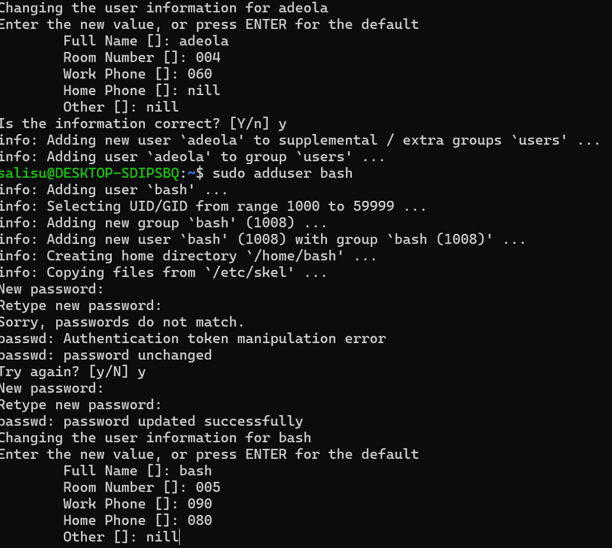
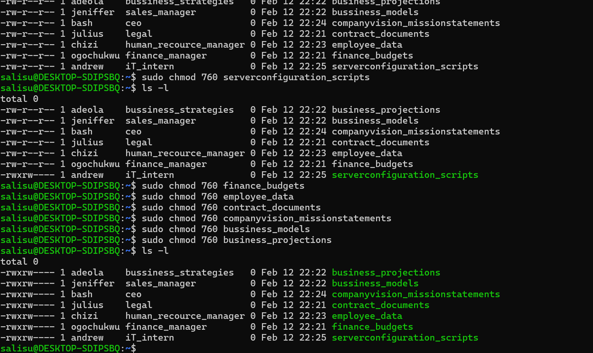

# Linux User & Directory Management – Cloud Infrastructure Setup

> **Role:** Cloud Engineer  
> **Task:** Create company users, assign groups, create directories, and configure access permissions.

---

## 📋 Table of Contents

1. [Overview](#overview)
2. [Step 1 – Create Groups](#step-1--create-groups)
3. [Step 2 – Create Users & Assign Groups](#step-2--create-users--assign-groups)
4. [Step 3 – Verify Users & Groups](#step-3--verify-users--groups)
5. [Step 4 – Create Company Files](#step-4--create-company-files)
6. [Step 5 – Set Ownership & Permissions](#step-5--set-ownership--permissions)
7. [Step 6 – Verify Permissions](#step-6--verify-permissions)
8. [Screenshots](#screenshots)

---

## Overview

The following employees and their roles were provisioned on the server:

| Employee     | Role                     | Group          |
|--------------|--------------------------|----------------|
| Andrew       | System Administrator     | `sysadmin`     |
| Julius       | Legal                    | `legal`        |
| Chizi        | Human Resource Manager   | `hr`           |
| Jeniffer     | Sales Manager            | `sales`        |
| Adeola       | Business Strategist      | `strategy`     |
| Bach         | CEO                      | `management`   |
| Gozie        | IT Intern                | `it`           |
| Ogochukwu    | Finance Manager          | `finance`      |

The following company files were created and secured:

| File                        | Owner         | Group        | Permission |
|-----------------------------|---------------|--------------|------------|
| `finance_budgets`           | `ogochukwu`   | `finance`    | `760`      |
| `contract_documents`        | `julius`      | `legal`      | `760`      |
| `business_projections`      | `adeola`      | `strategy`   | `760`      |
| `business_models`           | `adeola`      | `strategy`   | `760`      |
| `employee_data`             | `chizi`       | `hr`         | `760`      |
| `vision_mission_statement`  | `bach`        | `management` | `760`      |
| `server_config_scripts`     | `andrew`      | `sysadmin`   | `770`      |

> **CEO Access:** Bach was added to all groups so he inherits each group's permissions across all files.

---

## Step 1 – Create Groups

Each department/role was assigned a Linux group.

```bash
sudo groupadd sysadmin
sudo groupadd legal
sudo groupadd hr
sudo groupadd sales
sudo groupadd strategy
sudo groupadd management
sudo groupadd it
sudo groupadd finance
```

> **Verify groups were created:**
```bash
cat /etc/group | grep -E "sysadmin|legal|hr|sales|strategy|management|it|finance"
```

---

## Step 2 – Create Users & Assign Groups

Each user was created with a home directory and immediately assigned to their respective group.

```bash
# Andrew – System Administrator
sudo useradd -m -G sysadmin andrew
sudo passwd andrew

# Julius – Legal
sudo useradd -m -G legal julius
sudo passwd julius

# Chizi – Human Resource Manager
sudo useradd -m -G hr chizi
sudo passwd chizi

# Jeniffer – Sales Manager
sudo useradd -m -G sales jeniffer
sudo passwd jeniffer

# Adeola – Business Strategist
sudo useradd -m -G strategy adeola
sudo passwd adeola

# Bach – CEO (primary group: management, added to all groups for full access)
sudo useradd -m -G management bach
sudo passwd bach

sudo usermod -aG finance bach
sudo usermod -aG legal bach
sudo usermod -aG hr bach
sudo usermod -aG sales bach
sudo usermod -aG strategy bach
sudo usermod -aG sysadmin bach
sudo usermod -aG it bach

# Gozie – IT Intern
sudo useradd -m -G it gozie
sudo passwd gozie

# Ogochukwu – Finance Manager
sudo useradd -m -G finance ogochukwu
sudo passwd ogochukwu
```

> **Flag explanation:**  
> `-m` → creates a home directory at `/home/<username>`  
> `-G` → assigns the user to a supplementary group  
> `-aG` → appends the user to an additional group without removing existing ones

---

## Step 3 – Verify Users & Groups

```bash
# List all created users
cat /etc/passwd | grep -E "andrew|julius|chizi|jeniffer|adeola|bach|gozie|ogochukwu"

# Confirm group memberships
id andrew
id julius
id chizi
id jeniffer
id adeola
id bach
id gozie
id ogochukwu
```

---

## Step 4 – Create Company Files

All company document files were created using the `touch` command.

```bash
sudo touch finance_budgets
sudo touch contract_documents
sudo touch business_projections
sudo touch business_models
sudo touch employee_data
sudo touch vision_mission_statement
sudo touch server_config_scripts
```

> **Verify files were created:**
```bash
ls -l
```

---

## Step 5 – Set Ownership & Permissions

Each file was assigned to its group manager as owner. The `760` permission grants the owner full access (rwx), group members read/write access (rw-), and blocks all others. The `server_config_scripts` file uses `770` so Gozie (IT intern) can also execute scripts.

```bash
# Finance Budgets → owned by ogochukwu, group: finance
sudo chown ogochukwu:finance finance_budgets
sudo chmod 760 finance_budgets

# Contract Documents → owned by julius, group: legal
sudo chown julius:legal contract_documents
sudo chmod 760 contract_documents

# Business Projections → owned by adeola, group: strategy
sudo chown adeola:strategy business_projections
sudo chmod 760 business_projections

# Business Models → owned by adeola, group: strategy
sudo chown adeola:strategy business_models
sudo chmod 760 business_models

# Employee Data → owned by chizi, group: hr
sudo chown chizi:hr employee_data
sudo chmod 760 employee_data

# Vision & Mission Statement → owned by bach, group: management
sudo chown bach:management vision_mission_statement
sudo chmod 760 vision_mission_statement

# Server Config Scripts → owned by andrew, group: sysadmin (770 for IT intern execute access)
sudo chown andrew:sysadmin server_config_scripts
sudo chmod 770 server_config_scripts
```

> **Permission breakdown:**  
> `760` → Owner: `rwx` | Group: `rw-` | Others: `---`  
> `770` → Owner: `rwx` | Group: `rwx` | Others: `---` *(used for server_config_scripts so Gozie can execute)*

> **CEO Access:** Bach was added to all groups via `usermod -aG`, so he automatically inherits the group permissions of every file — no ACL needed.

---

## Step 6 – Verify Permissions

```bash
# Check ownership and permissions for all files
ls -la

# Confirm Bach's group memberships (should show all groups)
id bach
```

---

## Screenshots

### Users Created


### Groups Created


### Changing Group Ownership


### Changing File Ownership


### Directory Permissions


---

## Summary

- ✅ **8 users** created with home directories and secure passwords
- ✅ **8 groups** created matching company departments/roles
- ✅ **7 company files** created using `touch`
- ✅ Each file owned by the group manager (e.g. `ogochukwu` for finance)
- ✅ Permissions set to `760` for all files — group members get read/write, no execute
- ✅ `server_config_scripts` set to `770` — IT intern (Gozie) gets full rwx access
- ✅ CEO (Bach) added to all groups via `usermod -aG` — no ACL required
